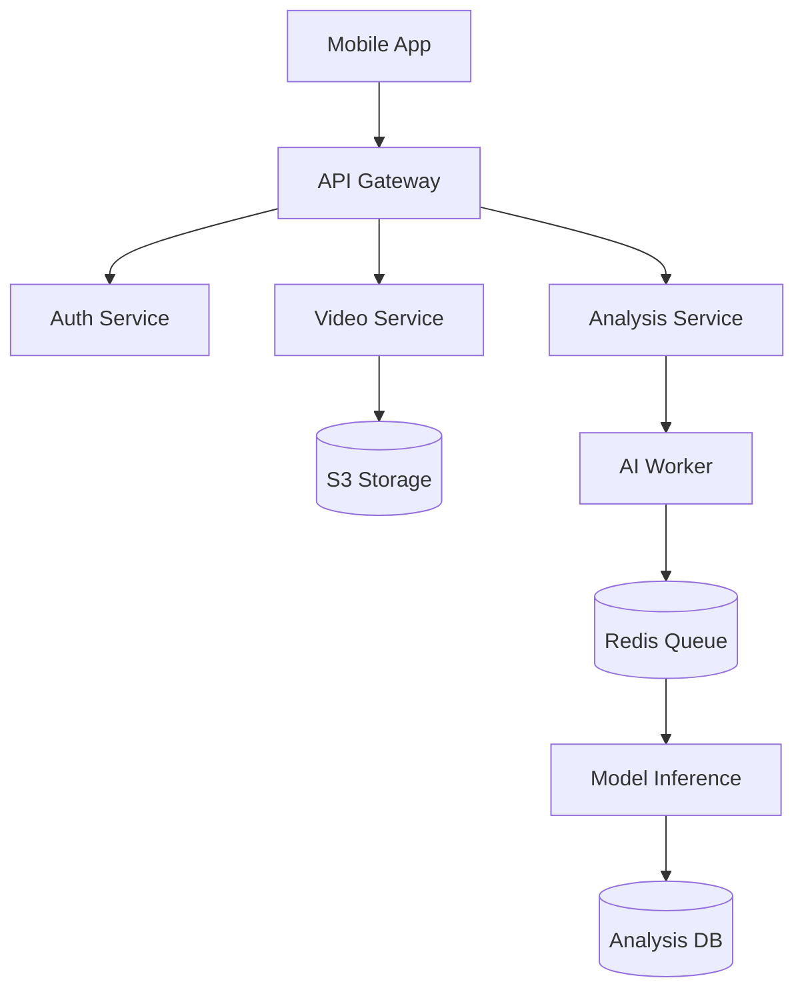

# SwingMatch - AI-Powered Tennis Coaching Platform


## Table of Contents
- [Project Overview](#project-overview)
- [Key Features](#key-features)
- [Technology Stack](#technology-stack)
- [System Architecture](#system-architecture)
- [Getting Started](#getting-started)
- [Contributing](#contributing)
- [License](#license)

## Project Overview
SwingMatch revolutionizes tennis coaching through AI-powered stroke analysis and professional player comparisons. This mobile-first platform combines computer vision and machine learning to provide real-time feedback and personalized improvement simulations.

**Core Capabilities:**
- 🎾 AI-driven biomechanical analysis
- 🏆 Pro player comparison system
- 📹 Intelligent video simulation
- 📊 Progressive skill tracking

## Key Features
| Feature | Description |
|---------|-------------|
| AR-Guided Recording | Optimal phone positioning for quality capture |
| Stroke Analysis | Frame-by-frame pose estimation and metrics |
| Pro Comparisons | Side-by-side/overlay views with top players |
| AI Simulations | Generated videos showing improved form |
| Progress Tracking | Historical performance analytics |

## Technology Stack
**Frontend**
- React Native (TypeScript) + Expo
- MediaPipe for mobile vision
- React Navigation + Reanimated

**Backend Services**
- Python FastAPI microservices
- PostgreSQL + Redis
- AWS S3 + CloudFront CDN

**AI/ML**
- TensorFlow/PyTorch models
- MediaPipe Pose Estimation
- GAN-based video generation

**Infrastructure**
- Docker + Kubernetes
- AWS ECS/Fargate
- GitHub Actions CI/CD

## System Architecture


## Getting Started

### Prerequisites
- Node.js 18+
- Python 3.10+
- Expo CLI
- AWS Account

### Installation
```bash
git clone https://github.com/yourorg/swingmatch.git
cd swingmatch
npm install
expo start
```

### Configuration
Create `.env` file:
```env
API_BASE_URL=your_api_gateway_url
AWS_ACCESS_KEY=your_key
AWS_SECRET_ACCESS_KEY=your_secret
```

## Contributing
1. Fork the repository
2. Create feature branch (`git checkout -b feature/AmazingFeature`)
3. Commit changes (`git commit -m 'Add amazing feature'`)
4. Push to branch (`git push origin feature/AmazingFeature`)
5. Open Pull Request

## License
Distributed under MIT License. See `LICENSE` for details.

---

📄 Full technical specifications available in [SwingMatch Technical Specifications.md](SwingMatch%20Technical%20Specifications.md)
